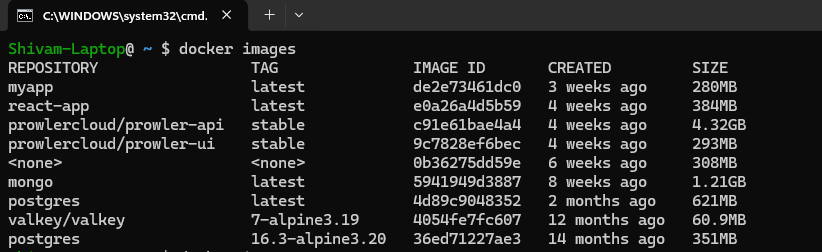

# AWS ECR(Elastic Container Registrary)

    Simple : As we use Docker Hub to store Docker Images AWS also Provide ECR to Store Images

    Amazon ECR is used A fully managed Docker container registry by AWS.
    It is used to Stores, manages, and pulls container images.
**Best for:** Teams already on AWS; use it as the image hub for ECS/EKS workloads.

**ECR**  - if you want to stick with aws services then ECR is Good it pull images 
faster than Docker hub when u r using same amazon environment.
how ECR Charge in AWS what bases 

## ✅ List of Images That are Currently in My Local Laptop

</img>

    Today we will use ECR to sotre the Registry instead of Docker hub.

# 🔹 Steps To Setup ECR inside AWS

### Step 1: Login AWS Account
    Search for ECR > You will Get this Dashboard

</img>

    Click on Create a Repository

#### Fill The Details 

</img>
    
</img>

    Choose Encryption Methods > Click on Create

### Step 2: Before Push Configure or Login Your AWS Account on Your Account
    Make sure you have aws cli installed on your machine

</img>

### Step 3: How to Push the Local Image to AWS ECR
    Since you login with your aws account Locally

</img>

    Click on that Repository in My Case payment/frontend you will get an option View Push Command 
    Clikc on View Push Command 

</img>
     

### Step 4: Understood All the Command 

**aws ecr get-login-password --region us-east-1 :** This Command will access your login Crediantials of ECR

**docker login --username AWS --password-stdin :** This Command will Execute and Login the Docker with AWS ECR.

**926944000247.dkr.ecr.us-east-1.amazonaws.com**: This is the URL of my Registry.(This is like HUB.Docker.com same as aws ).

### ✅ Combine All and Run:
    aws ecr get-login-password --region us-east-1 | docker login --username AWS --password-stdin 926944000247.dkr.ecr.us-east-1.amazonaws.com

### Step 4: Build Your Docker Images if already exist then don't Do.
    First Inside your application write docker file then run this build command

    > docker build -t payments/frontend .

</img>

    Your will like this when list all Images

</img>

### Step 5: After the build is completed, tag your image so you can push the image to this repository:

</img>

    docker tag payments/frontend:latest 926944000247.dkr.ecr.us-east-1.amazonaws.com/payments/frontend:latest

</img>

#### Step 6: Run the following command to push this image to your newly created AWS repository

    > docker push 926944000247.dkr.ecr.us-east-1.amazonaws.com/payments/frontend:latest

</img>

#### Step 7: Verify on AWS ECR Dashboard

</img>

    Tage letes is over there 

#### Step 7: Change some Code and Push new Version 

</img>

    docker push 926944000247.dkr.ecr.us-east-1.amazonaws.com/payments/frontend:v1

</img>

