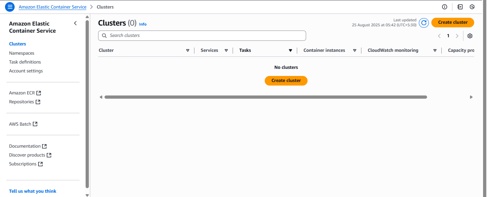

# AWS ECS(Elastic Container Service)
    AWS ECS (Elastic Container Service) is a service that helps you run and manage containers (like Docker) on the cloud without worrying about the underlying servers.

      

### Simple Example

    Imagine you have a website built with React and Node.js.
    You put your website into a Docker container.

    You want it to be available all the time and handle more visitors when traffic spikes.
    Instead of managing servers manually:
    You push your container image to AWS ECR (Elastic Container Registry).

    You tell ECS to run it. ECS will:
    
    ✅ Launch the container on EC2 or Fargate (serverless option).
    ✅ Automatically restart it if it crashes.
    ✅ Scale more containers if traffic increases.

    ✅ Result: Your website stays live and can handle more visitors without manual work.

## Step 1: Connect ECR Registory to ECS
    Search for AWS Container Service 

    Click on Get Started > You will Redirect to Here
  
  

    Click on Create Cluster :
    📌 In Amazon ECS (Elastic Container Service),
    a Cluster is simply a logical group (or box) where your containers (tasks/services) run.

  

## Step 2 : Fill Details

  

    Here You Can Deploy your Docker Image on Amazon EC2 or Amazon Farget. For Now i will Go with Farget 

**Farget :** This is a server less service used to deploy the Docker Images without worrying about the server. 
**Amazon EC2 instances :** You can Deploy Your Image Manually on EC2 also.

### Note:
    You Can Select Both and Tell them 30% Traffic will Go to EC2 and 70% on Farget.

    ✅ Choose Farget > Click on Create

  

## Step 3: Verify your CloudFormation 
    
  

    When you create an ECS cluster, service, or task using the AWS Console, sometimes you see CloudFormation stacks automatically created in the background.

    - ECS is integrated with CloudFormation.
    - Instead of you writing the template, the console wizard generates it for you.

    So, CloudFormation = behind-the-scenes engine that actually provisions the infrastructure.

## Step 4: Create Task definitions

    I Created the ECR > Then Cluster > Now Create Task Defination
-   Task Defincation: A Task Definition is like a blueprint (recipe) that tells ECS: 👉 “How should I run a     container (or multiple containers)?”    

 

    ✅ Click On New Task Defination

 

### Infrastructure requirements:
    Since You Have to defince at What configuration your app need to run.

    Give the Task Name : In My Case payment-app-frontend

 

    i) Launch Type : Choose AWS Fargate
    ii) Operating system/Architecture : Linux/X86_64 
    iii) CPU : Since Node js is Single Threade 1 CPU is Enough
    iv) Memory : Give the RAM Size (3GB my Case)

### ✅ Container – 1 Info : 
    Specify a name, container image and whether the container should be marked as essential. Each task definition must have at least one essential container.

 

    i) Name : payment-app-frontend
    ii) Image URI : This Can be Either hub.docker.com/_/image_name or ECR Image URL with Tag
        ✅ Ex - 926944000247.dkr.ecr.us-east-1.amazonaws.com/payments/frontend:v1

    iii) Container port : at What Port Your Container is Running = 3000
       ✅ Ex - docker run -p 3000:3000 my-payment-app

  

### Environment variables - optional
    If you have Environment Varible add it also 

    

### Log collection
    Define at what location do you want to store the log inside CloudWatch

 

 

 

    ✅ Keep Everything Optional For Now Click on Create.....

 

    All Done You Will Get this Dashboard ✅

## Task Basically Blue Print or Short of Launch Template is Done 

    Here I Created Cluster Then Created a Task (Blue Print) > ✅ Now Create The Service 

## Step 5: Creatin a Service in Your Cluster

    First Go to Cluster Section > Click on Your Cluster Name That You Created 
    ✅ Task is Created menas BluePrint is Created But it is Not Running Through Service we start the Task

## 0 Service are Currently 

