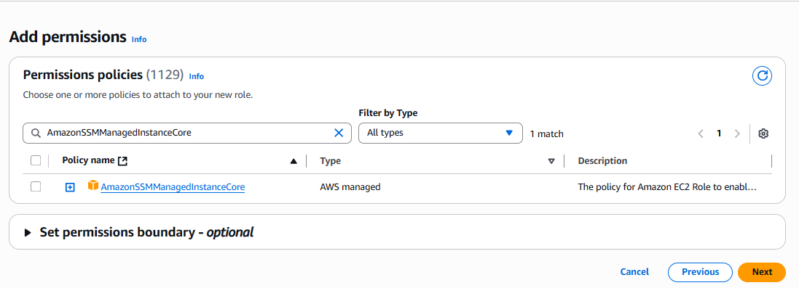

# Create IAM Role for SSM Manager

## 🔎: Cretae IAM User and Give the IAM Role and Attahced the Policy 
    Go to IAM → Roles → Create role

    Click on Create Role

    Choose AWS Service

    ✅ Choose EC2
    ✅ Click on Next

# Add permissions > Search this AmazonSSMManagedInstanceCore Policy 

    select that and click on next

## Give the Role Name 

    In My Case i Give the Name EC2-SSM-Role

    Click on Create Role

    Role is Created 

