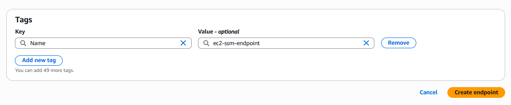

# 🔑 AWS Session Manager
    Use AWS Systems Manager (SSM) Session Manager to connect to EC2 instances without a bastion host, SSH (22), or RDP (3389). This runbook gives you production‑ready steps (Console and CLI), hardening, logging, and troubleshooting.

## Step 1 🔎: First You Have to Create IAM User 
<h3><a href="./IAM-Role-Creation/README.md">Click Here</a>  </h3>  

## Step 2 🔎: Attach IAM Role to EC2 Instance
    GO to EC2 Dashboard → Click on Running Instances

    Click on Action → Click on Security → Click on Modify IAM Role

    You will Redirect to this

    Select The Role the you previously Created 

    Click on Update IAM Role

    You will Get Successfully IAM Role Attach

## verify the SSM Manager Login 
    You will Get this

    SSM Agent is not online
    The SSM Agent was unable to connect to a Systems Manager endpoint to register itself with the service.

## Step 3 🔎: Create Endpoints
    GO to VPC Console

    Search for VPC Endpoints
    Click on Create endpoints

   In Services Section

     Select there service
    

     Choose VPC as Per Your VPC and Enable DNS Name 

    👉: Pick the subnets in each AZ where your private EC2s run.

    in my case this.

    Select the Required Security Groups

    Give Full Access for Now.

    Let Everything be default and Click on create Endpoint

    VPC End Poitns Gets Created status is Pending wait for the Status to be Updagrade to Available.

    Now Status is Availaible now you can use this VPC endpoints.

## Step 4 🔎: Verify AWS Systems Manager

    Go to Explore nodes 

    Here in the VPC that i Choose there are 3 subnets right now inside that subnts 2 EC2 are Running that why 
    it is Showing 2 Node.

    Select Node ID > Click on Node Action > Connect > Start Terminal session

 

