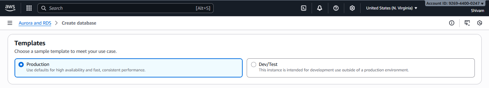

# Amazon Aurora PostgreSQL
    AWS Aurora is a managed database service this is 3x faster than normal mysql.

## Pre Requisite 
   🔹 Create A VPC 
   🔹 Create Internet Gateway
   🔹 Associate Internet Gateway to VPC  
   🔹 Create Subnets 
   🔹 Create Route Table
   🔹 Associate Subnets inside Route Table
   🔹 Associate Internet Gateway Inbout Access to Route Table

<h3><a href="./VPC/README.md">VPC Creatinon Steps</a></h3>

### Today I will Implement Amazon Postgress DB

## ✅ Step 1: Login AWS Console

    

    > Search for Aurora RDS > Click on that > Click on Create Database

    Choose a database creation method = Standerd Creation
    Engine Type = Aurora (PostgreSQL Compatible)

    Choose the Version as per your need
    I will go with = Aurora PostgreSQL (Compatible with PostgreSQL 17.5) - default for major version 17

    ✅ I will Go with Production

    ✅ Give the DB Cluster Name

    master username = shivam
    Credentials management = I will Store my DB username and Password inside Managed in AWS Secrets Manager - most secure. so no changes. i will not got with self managed

    ✅ Keep Encryption Key Default

    Aurora I/O-Optimized : If your app need more Input Output Operation 
    Aurora Standard : this is more costly than Aurora I/O-Optimized but very fast 

    ✅ I will go for now Aurora I/O-Optimized

    Choose DB Configuration 

    I will Go with Burstable classes (includes t classes) > Default value 

    Choose option one for an Aurora Replica for fast failover and high availability.

    ✅ Since i dont have any insatnce running i will manually do so i choose   Don’t connect to an EC2 compute resource > Choose IPv4 

    ✅ Choose VPC > Choose Public Access Yes (another keep Default)

    ✅ Give new Security Group Name

    ✅ Give the Port Default

    This mean if any query come which just insert then my primary replica will handle but if user is just crowsing and making get request menas just reading then it will go from read replica.

    ✅ select the Box

    Keep Tag or leave it.

    If you are Miigrating from SQL Server and want minimal code changes and your SQL Server Query Will Generate result and sotre in Aurora Posgress

    ✅ I am not selecting anything

    ✅ Levae Database authentication Dont select anything for Now 

    Choose Standerd Insight > Keepp Everything Default

    For now I want all log to view on cloudWatch so that i created that.

    ✅ Choose this This will Suggest RDS automatically detects performance anomalies for DB instances and provides recommendations.
    This will take charge.

    Give initial Database Name : hotelDB
    Keep everything default

 

    tier-0	Highest
    tier-12	Very low
    tier-15	Lowest possible

    So i choose 0

    Leave Default

    Click on Create database

### Writer : Handles all reads & writes
### Reader : Standby (for failover) & read scaling

