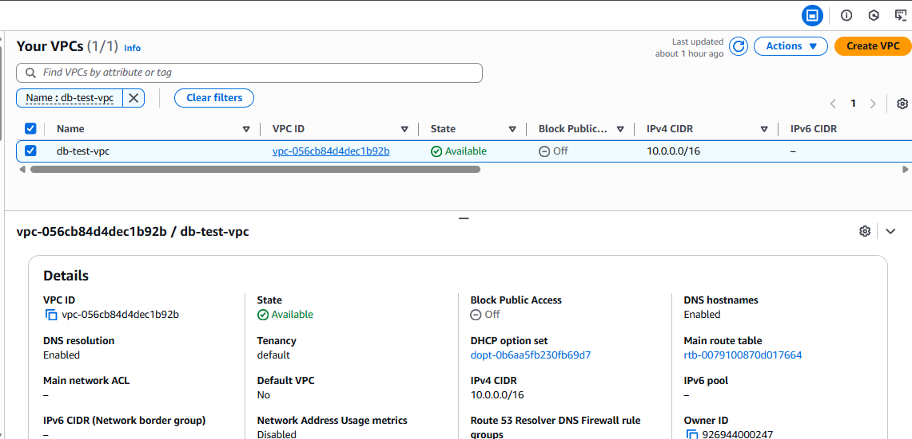
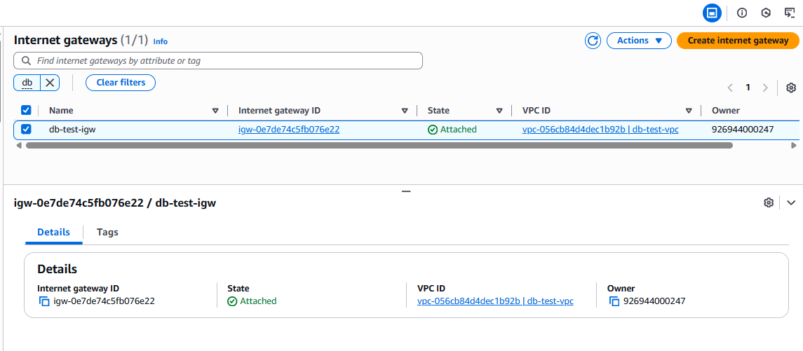
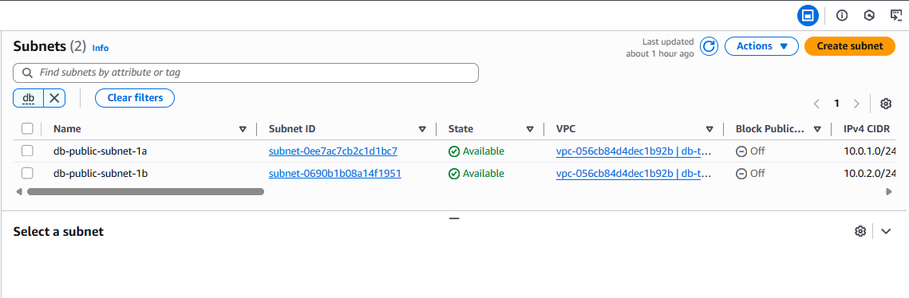
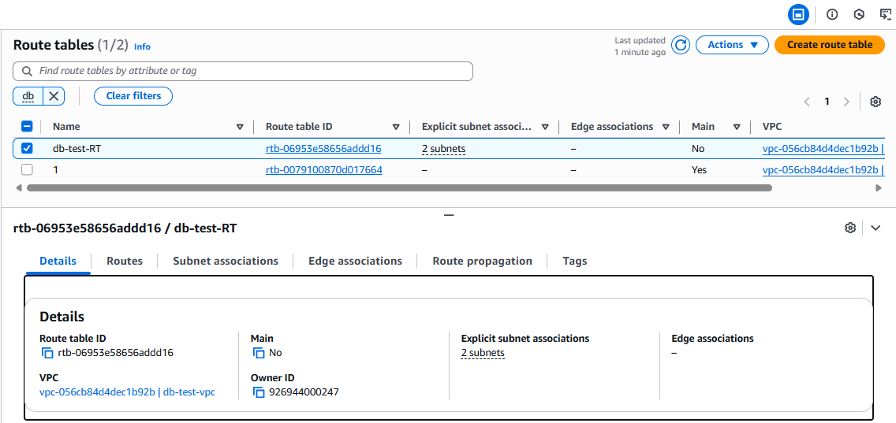
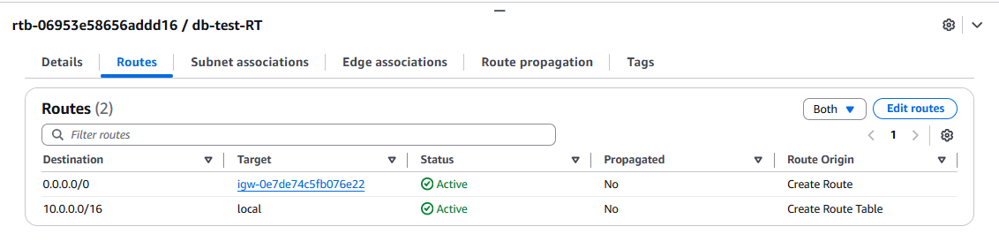

# Setting UP Networking For RDS

## 🔹 Step 1: Go to VPC Create VPC 

## 🔹 Step 2: Create Internet Gateway Associate with VPC

## 🔹 Step 3: Create Subnet inside the VPC 

## 🔹 Step 4: Create Route tables Associate Subnets as Per Your Route Tabel

## 🔹 Step 5: Associate Internet Gateway to Route Table

## ✅ All Done ✅
