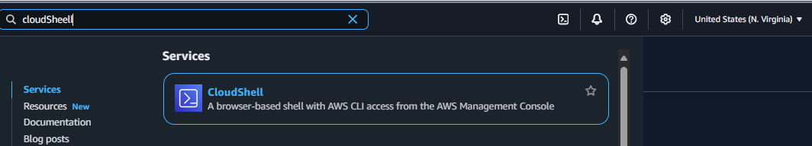
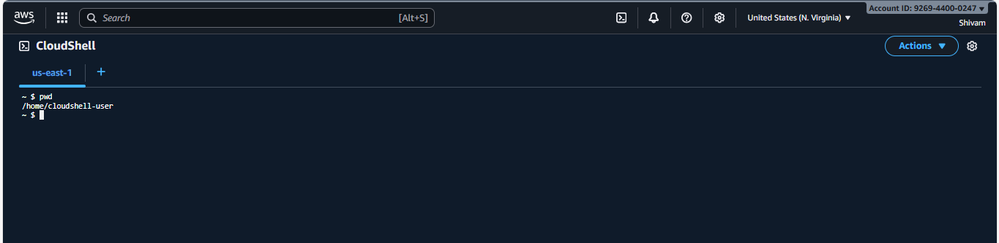
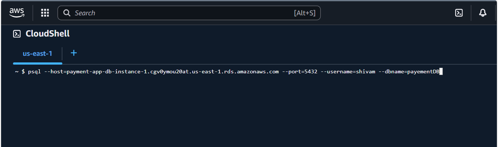
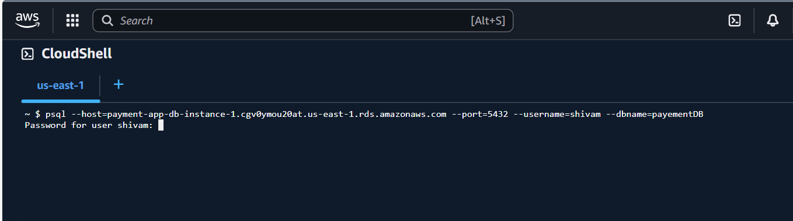
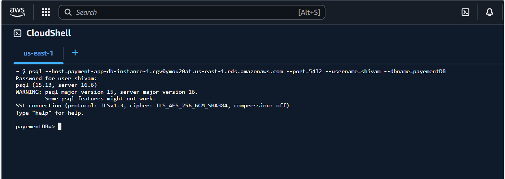
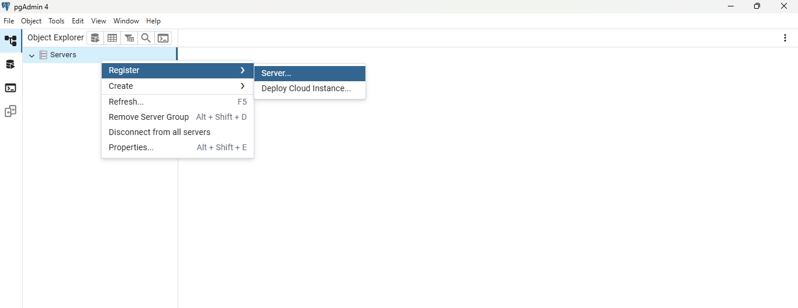
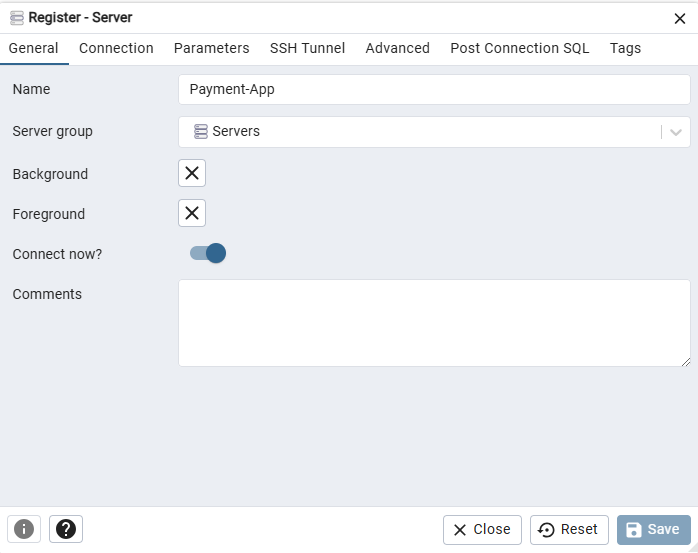
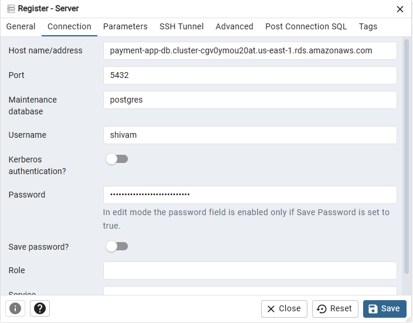
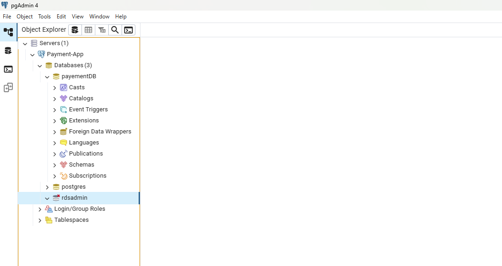

# Test The RDS Using Clients is IT Working Or Not 

## Quick Method to Verify That DB is Ready to Connect Using Endpoint

## 🔹 Step 1: ✅ Use AWS CloudShell

### 🔹 Install PostgreSQL client in CloudShell 
    sudo yum install postgresql15 -y

### 🔹 After install, connect with psql
    psql --host=mydb.abcdefghij.us-west-2.rds.amazonaws.com \
     --port=5432 \
     --username=mydbuser \
     --dbname=mydbname

- Chnage DB End Point 
- Change username
- Change dbname

    🔹 It will Ask for Password

    🔹 In My Case i took password from Secret Manager and paste here

   ✅ All Done I Connected with My PayementDB 

## 🔹 Step 2: ✅ Use PgAdmin Local on My Laptop
    Download the PG Admin On Laptop

    Right Click on Server > Click on Register > Click on Server

✅ All Done I Connected with My PayementDB 

