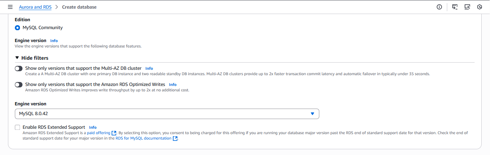
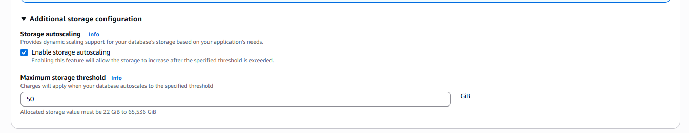
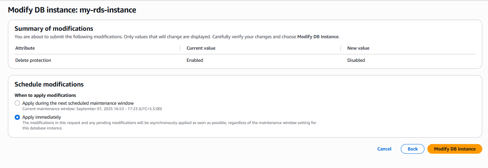

# 🥳 Amaozn MySql RDS(Relational Database Service) 🥳
    In This Documentation we will Build and Setup Amazon MySql Database.

## ✅ Step 1: Search The AWS RDS 

    ➤ Click on Create Database

## Step2: Choose a database creation method:
    

    Easy create: 
    ✦ In this AWS will auto-fill most of the settings for you.
    ✦ Basic default Backups enable, basic security groups
    ✦ You just need to give DB name, username, and password.
    ✦ It is Good for Beginer, Quick Testing or Demo.
    👉 You get less control.

    Standard create: 
    ✦ You get to choose all the details: Such as
    ✦ Instance type (small, medium, large)
    ✦ Storage size and type (SSD, magnetic, etc.)
    ✦ Multi-AZ (for high availability)
    ✦ Backup retention period
    ✦ Security groups / networking
    👉 It is Best for Production workloads

**I will Go with Standerd Create**

    💻 Choose Stander Create > Choose MySql

    ⚙ Engine version: Choose the Version of MySQL as Per Your Requirements

## Step 3: Choose Templates ☣:
    Production template: 
    ✦ Designed for real apps used by customers. 
    ✦ Comes with high availability (like Multi-AZ failover).
    ✦ Better performance and reliability.
    ✅ Use when → You’re deploying a live application where downtime or data loss is not acceptable.

    Dev/Test template:
    ✦ Cheaper and lighter than production.
    ✦ Lower availability (often just one DB instance, no automatic failover).
    ✦ Enough performance for developers to test code.
    ✅ Use when → You’re building/testing features, not serving real customers (e.g., your dev team trying out new queries or app features).

    Free Tier template: 
    ✦ Uses the AWS Free Tier offer (e.g., db.t3.micro instance with 20 GB storage for 12 months).
    ✦ Lower performance, limited features.
    ✦ ✅ Use when → You are learning AWS, experimenting, or building a small side project.
**I will -> Choose Production**

## Step 4: Availability and durability ✨
    🚀 Multi-AZ DB Cluster (3 instances)
    ✦ 1 primary (for writing) + 2 readable standbys (for reading).
    ✦ Automatic failover (if one fails, another takes over).
    ✦ Best for critical production apps (e.g., banking, e-commerce).
    💰 More expensive.

    🚀 Multi-AZ DB Instance (2 instances)
    ✦ 1 primary (write + read) + 1 standby (cannot be read, only for failover).
    ✦ Cheaper than 3-instance cluster, but no extra read scaling
    ✦ Best for production apps that need reliability but not huge read traffic.

    🚀 Single-AZ DB Instance (1 instance only)
    ✦ Just one database instance.
    ✦ No redundancy → if DB goes down, app goes down.
    ✦ Best for testing/dev or small apps.
    💰 Cheapest option.

**I will Go with Option 2 (Multi-AZ DB instance deployment (2 instances))**

## Step 5: Settings ⚙ 

    ⌨ Fill The Details Such as 
    » DB instance identifier - Name Of DB
    » Master username - shivam or admin
    » Credentials management - Choose Managed in AWS Secrets Manager - most secure
    ✅ Keep Everything Default

## Step 6: Instance configuration ☀ 
    This is basically choosing the “size” of your database server

    🚀1. Burstable classes (t classes – e.g., db.t3.micro, db.t4g.small)
    ✦ Small, cheap instances. Good for learning, small apps, dev/test.
    ✦ Example: Free Tier uses db.t3.micro.

    🚀2. Standard classes (m classes – e.g., db.m7g.large)
    ✦ Balanced between CPU, memory, and networking.
    ✦ Good for general-purpose production apps.
    ✦ Example: db.m7g.large → 2 vCPUs + 8 GiB RAM.

    🚀3. Memory optimized classes (r and x classes – e.g., db.r6g, db.x2g)
    ✦ More RAM, optimized for large datasets.
    ✦ Good for analytics, big databases, high read-heavy workloads.
    ✦ Example: Banking, healthcare apps with huge queries.

**I will Go with Stander Class From Drop Down Choose the Requirend RAM and VCPUs**

## Step 7: Storage ✚ 
    You set how much storage you want for your DB.

    ➼ Storage type 
    ✦ IOPS- Input/Output Operations Per Second → how fast your disk can handle reads/writes.
    ✦ Provisioned IOPS (io2) → High-performance SSD designed for critical, I/O-intensive workloads
       Ex - (banking, large e-commerce, analytics).

    Click on Aditional Storage configuration

    ✅ Storage autoscaling : Lets AWS automatically increase your storage if your DB is running out of space.
    Example: you start with 400 GiB, and set maximum 1000 GiB → if DB fills, it grows automatically.
    You only pay for what you use.
    Always a good option to enable (prevents DB crash when storage is full).

    ✅ Maximum storage threshold: Charges will apply when your database autoscales to the specified threshold

## Step 8: Connectivity 
    Connectivity section of RDS setup. This is about how your database can be reached (by EC2, apps, or outside world).

    ➤  Compute resource:
    👍Don’t connect to an EC2 compute resource → You’ll manually configure later which EC2 can connect.
    👍Connect to an EC2 compute resource → AWS auto-configures networking so a specific EC2 instance can connect to your DB right away.

    ➤ Network type
    ❊ IPv4 Your resources can communicate only over the IPv4 addressing protocol.
    ❊ Dual-stack mode Your resources can communicate over IPv4, IPv6, or both.

    ➤ Virtual private cloud (VPC) : If You Created VPC then Select that else Click on Create new VPC

    ➤ DB subnet group: If you select your created VPC it will automatically create inside that subnet else it will create subnet also automatically.

    ➤ Public access
    ✅ Yes → DB gets a public IP. Accessible from internet (if security group allows).
    Useful for testing or connecting from your laptop.
    Less secure.

    ✘ No → DB is private inside VPC. Only EC2/Lambda/resources inside VPC can connect.
    Best practice for production.

    👉 Testing → choose Yes.
    👉 Production → choose No (for security).

    ➤ VPC Security Group (Firewall) : Controls who can access DB.

    ➤ New VPC security group name - my-rds-instance-sg

    ➤ Certificate authority - optional : Choose any one of them(rds-ca-rsa2048-g1 (default))

    💎 Click on Additional configuration

    Define at what port your DB should Run for now 3306

    Tags - optional

    ➤ Database authentication
    ➺ Password authentication : You create a master username + password.
    👉 Best for learning, small apps, quick setups.

    ➺ Password and IAM database authentication : In addition to password, you can let users/applications log in using AWS IAM credentials.
    👉 Best for production apps, especially if you want passwordless + secure authentication.

    ➺ Password and Kerberos authentication : 👉 Best for enterprise environments where your company already uses Active Directory.

**I will Go with Password authentication**

    ➤ Monitoring :  This will help you track performance, troubleshoot, and optimize your database

    😍 Database Insights - Standard
    Keeps 7 days of history (enough for troubleshooting recent issues).
    Good balance between cost & insights.
    💰 Cheaper than Advanced.

    😍 Database Insights - Advanced
    Keeps 15 months of performance history (long-term trend analysis).
    Can monitor multiple DBs at once (fleet-level monitoring).
    Integrates with CloudWatch Application Signals (end-to-end app + DB monitoring).
    Best for enterprises/production systems where you need long-term trends & advanced monitoring.
    💰 More expensive.

    👉 If you’re just learning/testing → you don’t need Advanced.
    👉 If it’s production → Standard or Advanced depending on how deep you need monitoring.

    😍 Enable Performance insights: With Performance Insights dashboard, you can visualize the database load on your Amazon RDS DB instance load and filter the load by waits, SQL statements, hosts, or users. if you choose Database Insights - Standard then you will get option to enable and desable.

    🚀 Retention period : How long you keep the monitoring data. If you only keep 7 days (Standard), old data will be gone.

    👉 For testing → 7 days is fine.
    👉 For production → 15 months gives long-term insights.

    AWS KMS key: Encryption for monitoring data

#### Additional monitoring settings

    Enhanced Monitoring: if it is on menas 
    ➠ Regular RDS monitoring only shows DB-level metrics (CPU, RAM, disk usage). but 
    Enhanced Monitoring goes deeper → shows OS-level metrics inside the RDS instance.
    Which processes/threads are using CPU.
    Memory per process.
    Disk I/O per process.
    Useful for troubleshooting performance bottlenecks.

    Granularity : how often metrics are collected.
    Example: 60 seconds = updates every 1 minute.

    Log exports: You can send database logs to CloudWatch Logs (so you can view, search, and set alarms).

    Types of logs:
    Audit log → Security-related events (who accessed the DB, what actions).
    Error log → Database error messages.
    General log → All client connections + SQL statements (can get large, not always needed).
    IAM DB Auth Error log → Logs failures related to IAM authentication.
    Slow query log → Queries that take too long (great for performance tuning).

    👉 Best practice:
    Always enable Error log + Slow query log.
    Enable Audit log if security/compliance matters.
    Enable General log only temporarily (debugging), since it grows huge.

#### Additional configuration: Dont Do anyting in Additional Configuration

    ✅ Clikc on Create

  Click on View Connection Details

## Note: Since i Use AWS Secrets Manager to Store my Password lets Goo and find the DB Password.
    Click on Manage Credentials > You will Redirect to here

    Click on Retrieve secret value

## How to Use Now?
Step 1: Find the DB endpoint in RDS console.

Step 2: Use a DB client tool (Workbench, pgAdmin, DBeaver, CLI).

Step 3: Login with username + password.

Step 4: Start creating tables / inserting data.

Step 5: Connect your application (Node.js, Python, Java, PHP, etc.) using that endpoint.

## How to Delete The Database 

    In this Delete option is Not Showing 
    -> Click the DB > Go to Configuration

    Deletion protection : Enabled
    You have to Desable it then You can Delete 

    Go to Modify > Scroll to Deletion protection → set to Disable
    Click Continue → Apply immediately

    Uncheck or Disable 

    Click on Contineou

    Click on Apply Apply immediately > Modify DB instance

