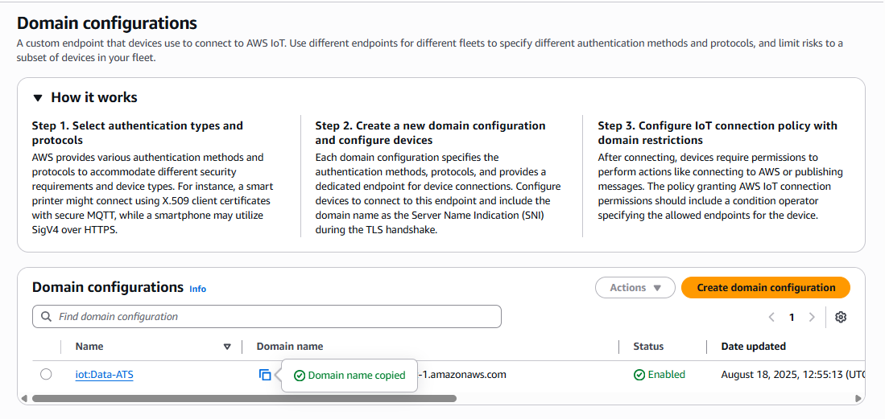
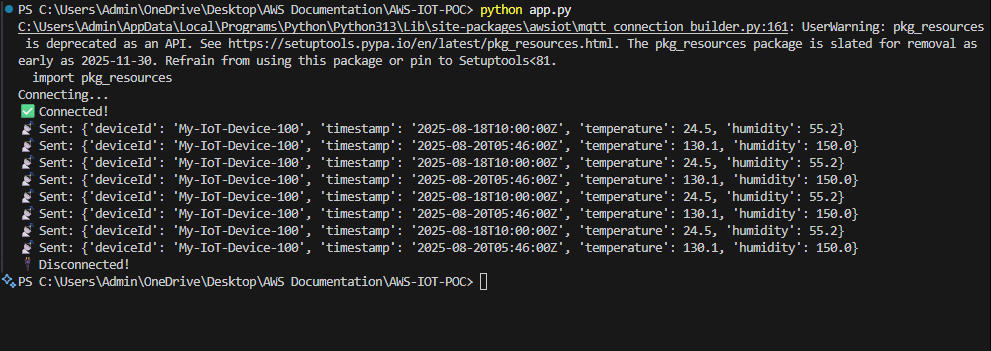
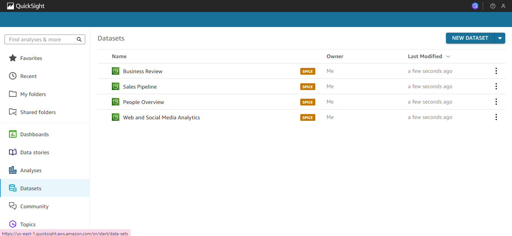
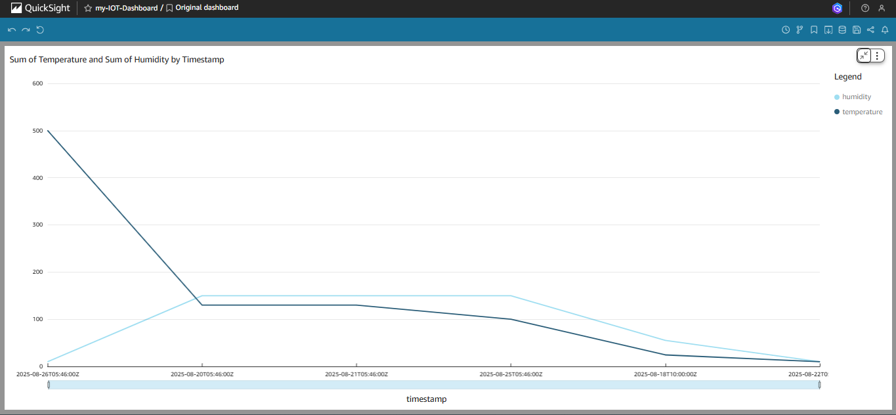

# IOT POC 

## Go To AWS Console
### Step- 1
    Click on Create Device

### Step - 2
    Click On Next 

### Step - 3
    Give Your Device Name and Then Click Next

### Step - 4
    Choose the Platfrom On Which Your IOT Device is

### Step - 5
    Click On Download Certificate Keep All Certificate 

### Step - 6
    Click On Next 

### Step - 7 
- Go to the Manage Section
    Clikc on All Device > Click On Things it will list all the things that you create.                                                                               
    
### List of Things

### Step 8:  Create Certificates
    > AWS IoT uses certificates to authenticate devices.

    > Click on Add Certificate > Click on Create Certificate

    Click on Create and Download All

- Attach these all certificate to the Things

    These all will Create

### Step 9: Create and Attach an IoT Policy
    A policy defines what your device can do in AWS.

Click on Create Policy

## Give the Policy Name And Atttach the given JSON

    {
      "Version": "2012-10-17",
      "Statement": [
      {
         "Effect": "Allow",
          "Action": [
          "iot:Connect",
          "iot:Publish",
          "iot:Subscribe",
          "iot:Receive"
        ],
        "Resource": "*"
       }
     ]
    }

- Click on Create Policy

- Go to Certificate Section > Select Certificate and Attach Policy

### Step 10: Get Your IoT Endpoint
    Go to Settings > Copy the Endpoint (something like a2lgtrntxmx70z-ats.iot.us-east-1.amazonaws.com) → corresponds to ENDPOINT in your code.

    Click on > View domain configurations
    Ex- a2lgtrntxmx70z-ats.iot.us-east-1.amazonaws.com

### Step 11: Update Your Python Code
#### Create a Certificate Folder and Put Your all Certificate Inside there 

    ENDPOINT = "a2lgtrntxmx70z-ats.iot.us-east-1.amazonaws.com"
    CLIENT_ID = "My-IoT-Device-100"
    PATH_TO_CERT = "./certificates/My-IoT-Device-100.cert.pem"
    PATH_TO_KEY = "./Certificates/My-IoT-Device-100.private.key"
    PATH_TO_ROOT = "./Certificates/My-IoT-Device-100.public.key"
    TOPIC = "test/device"
    CSV_FILE = "CSV-Data.csv"

### Step 12: Test the Device
    Go to MQTT Test Client > Subscribe to topic > give the same topic name that you give inside the code 

    All Data Will Reflect there

### Step 13: Create Rules in AWS IoT Core (Message Routing)
    AWS IoT Core Rules are like traffic controllers for your IoT data. They let you decide what happens to messages sent by your devices.
    like till now my MQTT Clinet is Getting Data but what next
    So Rule Decide what to do next?
    
    Click on Create Rule >

    Click on Next

    SELECT * FROM 'test/device'
    (add this i did mistake inside the image) else it will so $aws/null 

    Don't use semicolon in the last of SQL Statement In image i did mistake and give the Topic Name Ex- test/device   > Click on Next

#### Rule Action Menas :-  
    You can use multiple source to store data like in s3, in Database CloudWatch etc.

    This means: Whenever a message matches the rule, AWS IoT will take the message and save it to the selected S3 bucket.

    Example: Your IoT device sends a JSON like:
    {"deviceId": "dev01", "temperature": 28}
    This JSON will be saved as a file in S3.

### So Create A Bucket or Choose Existing Bucket(For Now Create a S3 Bucket);

- Now Go to Again IOT Rule Setup Section Click on Browse and Select the S3 that you Created

### Key :
    In S3, a bucket is like a folder, but the Key is like the full path + filename for an object inside that bucket.

    Example Key:
    transactions/${topic()}/${timestamp()}.json

    ${topic()} → will be replaced by the MQTT topic name (e.g., sensors/temperature)

    ${timestamp()} → will be replaced by the current timestamp (e.g., 1692624000)

    Resulting path in S3:

    s3://my-iot-bucket/transactions/sensors/temperature/1692624000.json

### Now Attach an Existing Role or Create a Role:
    AWS IoT needs permissions to access other AWS services (S3, Lambda, DynamoDB, etc.).
    IAM Role is how you grant those permissions securely.

    For Now I Click on Create New Role it will automatically assign 

    Click on Next 

### Review And Click On Create :-

- We will Get an Error Because Rule Topic is $aws/null not defined if we run python code data will not store inside the Bucket Cause topic is wrong.

    Update the SQL Topic and Write it Inside comma

    Clikc on Edit and add that and Clikc on Update

## Test and Verify Does Data in Storing or Not Inside Our Bucket
    Run Python Code 

    Verify Inside S3 Bucket 

    Data Is Comming 🥳🎉🎉🎉...............

### 1. What is Problem happening
    IoT Device was publishing messages to an MQTT topic (test/device).

    IoT Rule was configured to store messages directly in S3.
    Example: messages went to my-iot-device-bucket/test-device/${timestamp()}.json

    Limitation:You could store messages, but couldn’t easily organize by device, date, or folder structure.
    Couldn’t convert data from CSV or JSON or add extra processing logic.

    Bahut Gandat form me data store Ho rha tha 

### 2. Then i have to use lambda function that will execute and make a proper folder date wise inside my Bucket.
Lambda acts as a processor between the IoT Rule and S3.

- Go to Lambda Cretate a lambda function
    > Give the Name and Select the Run time > Click on Create

### 3. Add This Code Inside your Lambda Fucntion
<a href="lambda_function.py">Click Here</a>

    The Owner of Lambda Function means Role name select it and attach it a amazon policy
    > AmazonS3FullAccess

### 4. Where Lambda is attached
Lambda is attached as an action inside the IoT Rule.    
    IoT Device → MQTT Topic → IoT Rule → Edit → Choose Destination Lambda instead of S3

**Use of Lambda in IoT POC:**
Lambda is used to process messages from IoT devices before storing in S3. Before Lambda, messages were stored directly in S3 with static keys. With Lambda, we can:
Organize messages by device and date
Transform or filter data
Add custom logic before storage
Lambda is attached as an action in the IoT Rule, which triggers it whenever a message arrives on the MQTT topic.

# =========================================

# Athena Setup: 
    Amazon Athena is a serverless interactive query service provided by AWS that allows you to analyze data stored in Amazon S3 using standard SQL. You don’t need to set up or manage servers — you just point Athena to your data, define a schema, and start querying.

    ✅ In short: Athena lets you query data in S3 without managing databases or servers, using SQL, and pay only for what you query.

## Step 1: Open Athena
    AWS Console → search for Athena → open it

    If it’s your first time:
    Athena will ask you to choose a query result location in S3 (Athena stores query results in S3)
    Example: s3://my-athena-query-results/ (create a new bucket if needed)

   

    For Now i will Create a Bucket Where My Athena Query result will Store 

    If already Any Query S3 Bucket is Attached Click on Setting Change the S3 Bucket Location

    Click on Launch query editor 

## Step 1: Create Database
    give the Database name and Click on Run it will Create a database.

    Verify Database is Created or Not

## Step 4: Create a Table for Your JSON Data
-    Click Query Editor → Choose your database
-    Run a CREATE EXTERNAL TABLE query to point to your S3 folder:

    CREATE EXTERNAL TABLE  my_iot_database.device_data (
    deviceId STRING,
    timestamp STRING,
    temperature DOUBLE,
    humidity DOUBLE
    )

    ROW FORMAT SERDE 'org.openx.data.jsonserde.JsonSerDe'
    LOCATION 's3://my-iot-device-bucket/test-device/'
    TBLPROPERTIES ('ignore.malformed.json'='true');

-   ✅ Notes:
    LOCATION should point to the top-level folder containing your JSON files (test-device/).
    Athena automatically reads nested folders.
    Athena will read all nested folders automatically (2025/08/18/My-IoT-Device-100/...)
    ignore.malformed.json → ensures Athena skips any corrupted JSON instead of failing.  

    Choose your Database and for now it is Showing 0 Tables once your run it will update 

## Step 4: Verify the Table
    SELECT * FROM my_iot_database.device_data
    LIMIT 10;

-    Since Inside my Bucekt i have theree date records in the year of 2025-08 month 

## Step 5: Run Example Queries
Average temperature per device per day:

    SELECT 
        deviceId,
        date_parse(timestamp, '%Y-%m-%dT%H:%i:%sZ') as ts,
        avg(temperature) as avg_temp,
        avg(humidity) as avg_humidity
    FROM my_iot_database.device_data
    GROUP BY deviceId, date_parse(timestamp, '%Y-%m-%dT%H:%i:%sZ');

Count messages per device:

    SELECT deviceId, count(*) as message_count
    FROM my_iot_database.device_data
    GROUP BY deviceId;

# =============================================

# Amazon Quick Sight

    Amazon QuickSight is AWS’s business intelligence (BI) and data visualization service.
    This come under Anlytics Service

Simple Explanation:
        QuickSight helps you turn your data into charts, dashboards, and visual insights — like Excel charts but much more powerful and web-based.

    
## Step 1: Open QuickSight
    AWS Console → search for QuickSight → open it.

## Step 2: Create a Dataset from Athena

    Click on NEW DATASET it will Redirect to a Datasets Page choose Athena from There

### Configure Athena connection:

    Choose Athena Workgroup as [primary] Because i am using Primary Workgroup > Click on Validate > Create Data Source

##### What is Workgroup: 
    A workgroup is like a container for queries stores in Athena. to verify go to Athena Dashboard

    Right now i am using primary i can change it as per our requirement go to athen create a Workgroup also from there. i will do it later also. 

## Come Back to Quick SIght:
    Once you click on Create Data Source it will Redirect ti this > 

    Data source name: IoT_Athena_Source (any name)
    Database: my_iot_database
    Table: device_data

  Click on Select

    choose Directly query Athena or Import to SPICE
    SPICE: stores a copy for faster analysis (recommended for large datasets)
    For Now : Select Import to SPICE (for faster querying) or Directly query Athena (reads live from S3)

-   Click on Visulaize > 

    Choose Tiled → makes dashboard clean and easy to read.
    Use 1600px → standard desktop view.
    Click on Create

## Check the Policy Proper Else You will Get this SQL Error inside QuickSight:

## Step 3: You Will Get A Dashboard like this

    this is an Editor Dashboard

    Drag timestamp on bottom
    Drag humidity on x-axis
    Drag temprature on y-axis

    Based on your need drag and Drop it 

## Once Your Dashboard Setup is Done Click on Publish(Right Bottom)

## Run Your Python Local Code 

## Verify the Dashboard That you Created 
