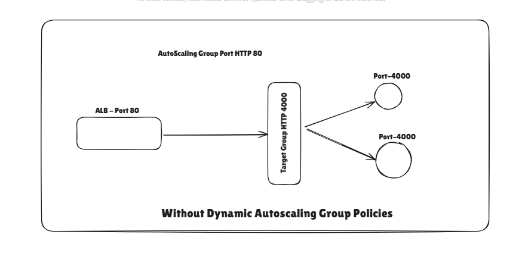
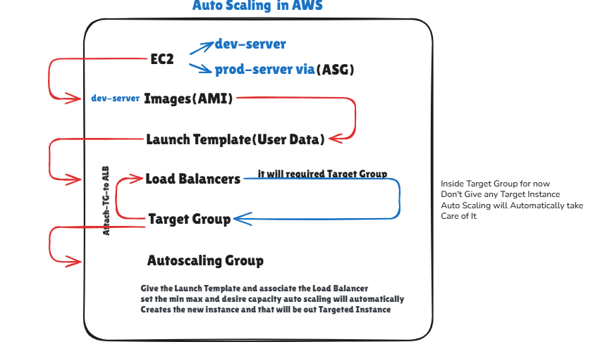

# AWS Auto Scaling 
## Flow Of AutoScaling With Application Load Balancer

   
## Steps To Setup SutoScaling Group

# Step 1: Create a Launch Template
If You have already any running server (EC2) and if you want Dicto Copy Server then create the AMI(Amazon Machine Image) of that existing server. Means your Entire Operating System, Configuration, and folder and files etc will be Grouped and become a OS image.
<a href="/Launch-Template/README.md">Click Here</a>

### Step 2: Create the Auto Scaling Group
    Go to EC2 Dashboard → Auto Scaling Groups → Create Auto Scaling groups                                    
## - Section 1: Choose launch template                                                                                      
       i) Give the launch Template name like - my-prod-app-lt                                                   
       ii) Select Launch Template from Drop Down Keep Version Default 1 as it is for Now.      
       iii) Choose Static IP and If Any User Data Choose that also                 
       iv) Click on next
## - Section 2: Choose instance launch options                                                                     
        i) Instance type requirements => if you want to change from t2 to t3 large then click on Override launch template else leave it as it is.                                                                 
        ii) Network Box: Choose VPC => Choose Subnets(Select at least two subnets in different AZs.)            
        iii) Availability Zone distribution :- When you use Auto Scaling Groups (ASG) in AWS, you can have your EC2 instances spread across multiple Availability Zones (AZs) for high availability.
If one AZ has problems (e.g., no capacity, AWS maintenance, network issues), Auto Scaling needs to decide:
Should it launch in another AZ to keep the app running?
Or should it wait until the original AZ is fixed to maintain perfect balance?  

    > ✅ Which one to choose for production? Recommended: Balanced best effort. and if you are in testing choose Balanced only.

## Section 3: Integrate with other Services                                                                    
        If you Do Not Want to Go with Load Balencing Option Choose 
        => No Load Balancer But Recommended to Go with Load Balancer
        Attach to an existing load balancer : if you already created load Balancer then => you have to 
        Choose from your load balancer target groups => Drop down to select load balancer

        VPC Lattice integration options: if you do this then your auto scaling group will be inside a secure network and VPC
        But for now leave it No VPC Lattice service => and read about VPC Lattice servie also

        Application Recovery Controller (ARC) zonal shift :
        In AWS, an Availability Zone (AZ) can sometimes have issues (like networking problems, hardware faults, or partial outages).ARC Zonal Shift is a feature that lets AWS temporarily move your traffic away from one AZ without you having to change your architecture 
        manually.           
        ✅ Recommended: Select ARC Zonal Shift

        2️⃣ Enable Zonal Shift
        If enabled → New EC2s will be launched only in healthy AZs until you manually cancel the shift.
        If disabled → Auto Scaling will still try to launch in the broken AZ (depending on your AZ strategy), which can cause delays.
        > Health check behavior ✅ Choose Replace 
        > Additional health check types : ✅ Trun on this one
        > Health check grace period : Example: If your app takes 2-3 minutes to boot, set grace period accordingly so AWS doesn’t kill it while    it’s still starting.Default: 300 seconds (5 min).Production tip: Set it to slightly longer than your app boot time.

## - Section 4: Configure group size and scaling 

