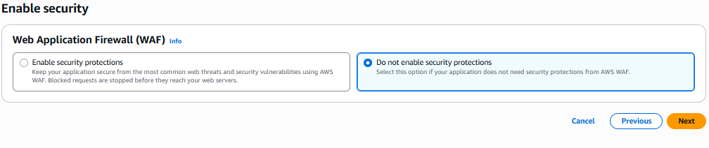

# How to Setup Cloud Front Step by Step

## Flow 
-    Clint(www.xyz.com) -> WAF -> CloudFront -> Alb -> Server

### Step 1: Go to CloudFront Dashboard
    Click on Create Distribution

### Step 2: Get started Section
    ✅ Distribution name - xyz-cloudFront

    ✅ Description - optional - Give the Description 

    ✅ Distribution type - Single website or app (Cause you have one one web page not SaaS Provider)

    ✅ Domain - optional = You Can leave it blank also

### Step 2: Specify origin
    ✅ Origin type - Choose Where you Content is Hosted Ex- (S3, ALB, API Gateway etc) 
    In My Case - Elastic Load Balancer

    ✅ Origin - Select From drop Down 

    ✅ Origin settings - Origin settings control how CloudFront connects to the specified origin like is there any port is already open on your origin such 80 or 443 or 3000
    Use recommended origin settings - It will Only Listen Default on Port 80

    ✅ Cache settings - Use recommended cache settings tailored to serving Elastic Load Balancing content

    ✅ If You Choose - Customize origin settings Give the Port of HTTP or HTTPs or anything based on you.

>    ✅ Click on Next

### Step 3: Enable security
    Web Application Firewall (WAF)  
    i) Enable security protections: If you choose this Option it will create a basic WAF also integrated with CloudFront
    II) Do not enable security protections: In this Options You can manually create WAF with High Security and Rule and Can Attach later 

    ✅ Do not enable security protections - I Will Create Later 

### Step 4: Review and create
    ✅ Click on Create

# ✅ Final Verify From Dashboard

you will get a distribution is created 

