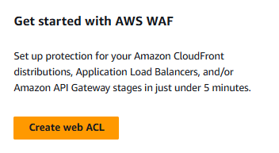
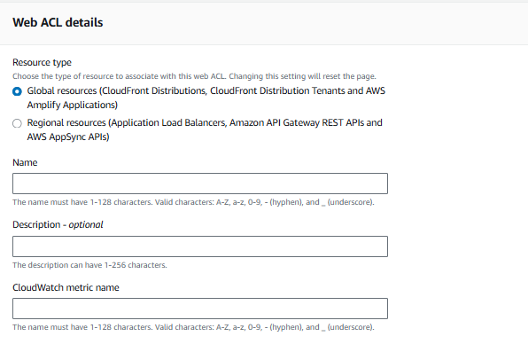
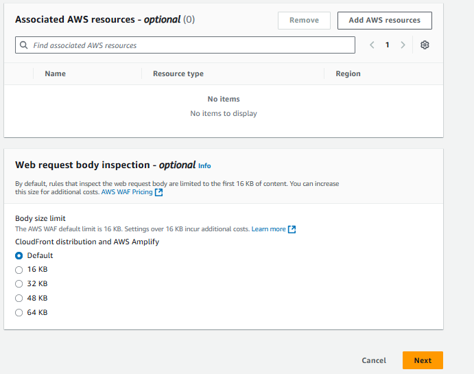
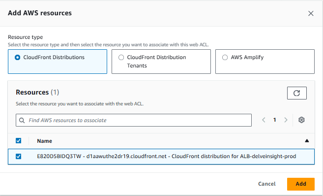
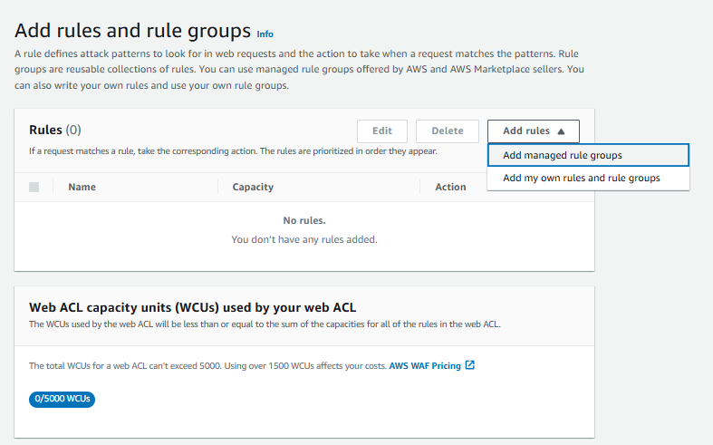
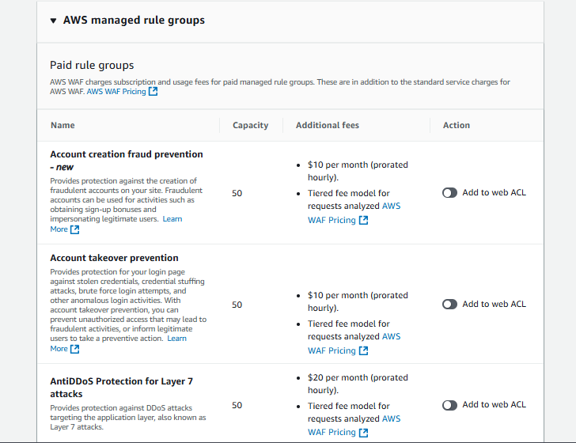
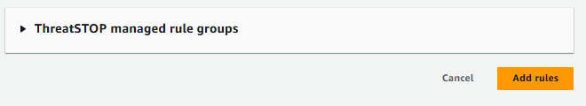
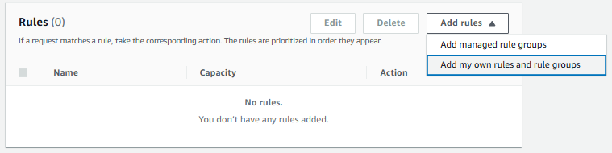
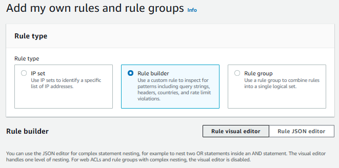

# Setup WAF&Shield to the CloudFront  : 
Protect your web applications from common web exploits

    Go to WAF&Shield Dashboard > Click on Create Web ACL

    ✅: You will Redirect to Fill Details Section

## Step 1: Describe web ACL and associate it to AWS resources 

### Section 1: Web ACL details
    ✅ Resource type: 
    i) Global resource :- CloudFront Distributions, CloudFront Distribution Tenants and AWS Amplify Applications 
    ii) Regional resources :- Application Load Balancers, Amazon API Gateway REST APIs and AWS AppSync APIs

    > If You Choose Global resource you does not need to choose region
    ✅ Region : Choose the region where your source is present

    ✅ CloudWatch metric name: deleveinsight-cloudwatch

    > Click on Add AWS resources

      
    > Click on Default and Clikc on Next

## Step 2: Add rules and rule groups 
    ✅ AWS Have Manage Rule Group Where Rules are already written by AWS.

    ✅ AND you have option of Add my Own rules and rules Group Where you can define your own rule set.

  
    - Click On Add Managed rule Group > after that AWS managed rule groups Expands this

  

***Add Rules Based On Requirements***
  

 ***Click on Add Rules***
You will redirect to Again Rule Section

 

- Now Add Your OWN Rule Set: **Click on Add own Rules and rule groups**

 

 

